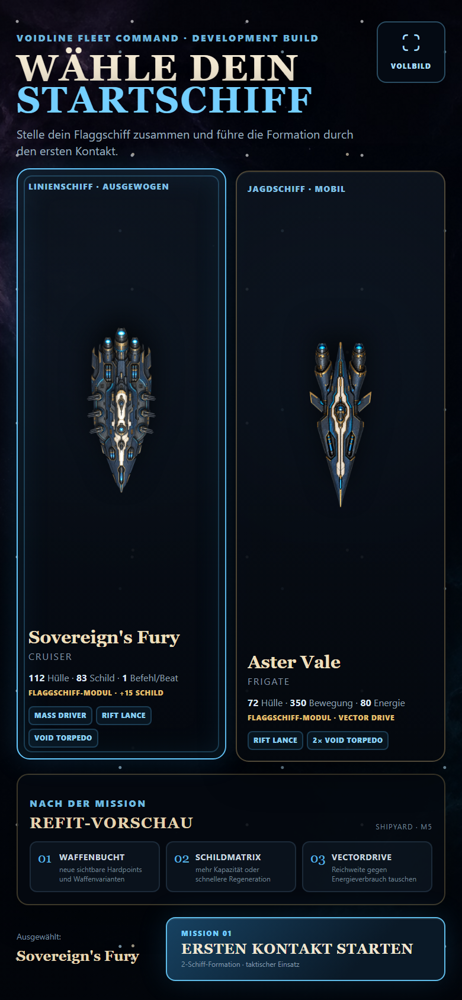
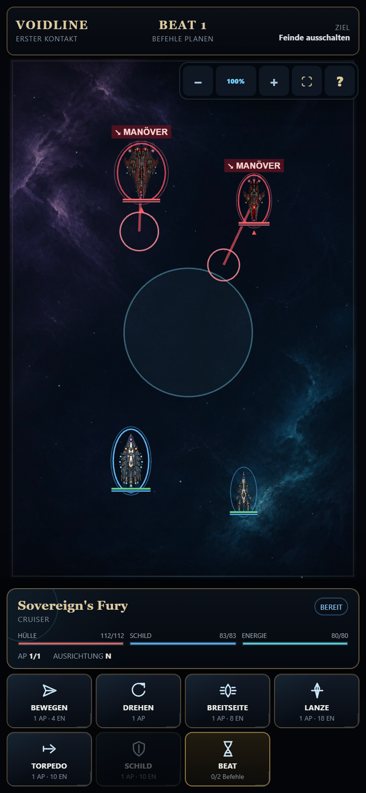
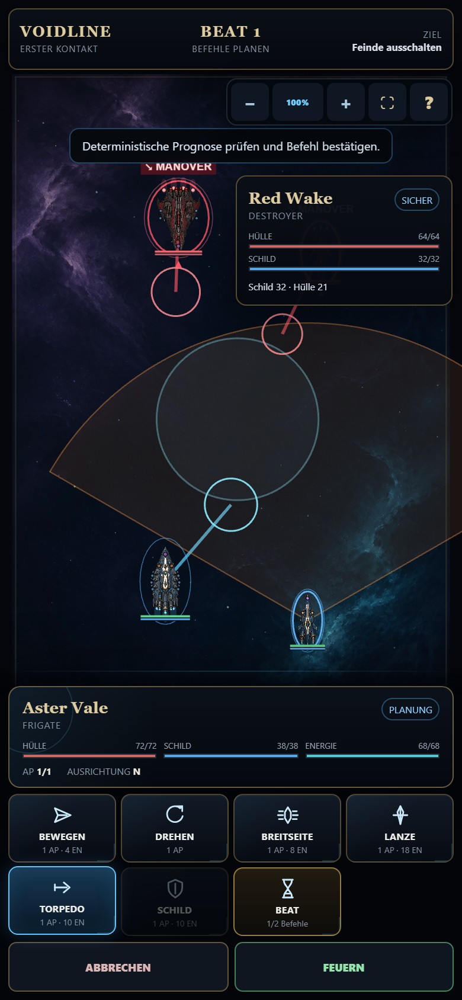

# Voidline Tactics

[](https://github.com/emfau88/Voidline-Tactic/actions/workflows/deploy-pages.yml)

Mobile-first 2D-Flottentaktik für den Browser: In kurzen **Command Beats** werden eigene Befehle gegen vollständig sichtbare Gegnerabsichten geplant und anschließend gemeinsam ausgeführt. Position, Facing, Feuerwinkel, Vorwärtsdrift und eine schützende Nebelzone verändern jede neue Feuerlösung.

## [▶ Jetzt im Browser spielen](https://emfau88.github.io/Voidline-Tactic/)

Der aktuelle Stand ist ein vollständig bedienbarer 2-gegen-2-Mobile-Kampf mit Startschiffwahl, zwei echten Flaggschiff-Modulen, vier originalen Schiffen, eigenem Nebula-Schlachtfeld und Hardpoint-basierten Kampf-VFX. Die App nutzt auf Phones die volle verfügbare Breite, rendert bis zu 2× HiDPI, bietet 80–180 % taktischen Zoom per Zwei-Finger-Geste, Buttons und Mausrad und aktiviert den Browser-Vollbildmodus, sofern die Plattform ihn für Webseiten erlaubt. Auf iOS ergänzt ein fullscreen-fähiges Web-App-Manifest den „Zum Home-Bildschirm“-Fallback. Der öffentliche Link wurde zuletzt am **21. August 2026** auf Mobile-Chromium geprüft und wird nach jedem Push erst nach Typecheck, Unit Tests, Production Build und Browser-Tests veröffentlicht.

## Aktueller Mobile-Build

| Startschiff und Refit-Vorschau | Gefechtsübersicht | Ziel- und Schadensprognose |
|---|---|---|
| [](docs/screenshots/mobile-fleet-selection.png) | [](docs/screenshots/mobile-combat-overview.png) | [](docs/screenshots/mobile-target-preview.png) |

Die Galerie lässt sich reproduzierbar mit `npm run capture:readme` gegen den lokalen Server oder über `CAPTURE_BASE_URL` gegen einen anderen Build aktualisieren.

## So funktioniert der Kampf

1. Rote Linien und Labels lesen: Sie zeigen den nächsten Befehl jedes Gegners.
2. Eigenes Schiff auswählen und genau einen Befehl planen: Manöver, Drehung, Waffe oder Schild.
3. Bei Bewegung das Ziel antippen und für die Ausrichtung ziehen; bei Waffen das gegnerische Schiff antippen.
4. Exakten Schaden und mögliche 25-%-Nebelreduktion prüfen, dann bestätigen.
5. Mit **BEAT** alle geplanten Manöver und Angriffe ausführen.

Broadside wirkt seitlich, Lance und Torpedo nach vorn. Treffer sind deterministisch; Torpedos verfehlen nicht und besitzen keinen versteckten Abfangwurf. Nach jedem Beat driften alle überlebenden Schiffe vorwärts. Dadurch ändern sich Distanz und Arc auch dann, wenn ein Schiff feuert.

## Projektstatus

- ✅ mobile-first App-Shell und responsives Touch-HUD
- ✅ echte Mobile-Vollbreite, Safe Areas, Fullscreen-Fallback, HiDPI und 80–180-%-Pinch-Zoom
- ✅ Startmenü mit Cruiser-/Frigate-Wahl, Flaggschiff-Modul und Refit-Vorschau
- ✅ Command-Beats mit sichtbaren Feindabsichten und gemeinsamer Ausführungsphase
- ✅ deterministische Treffer/Torpedos, kürzere Time-to-Kill und keine passive Schildregeneration
- ✅ Movement, Facing, permanente Vorwärtsdrift, taktischer Nebel, drei Waffen, Shield, Gegner-KI und Sieg/Niederlage
- ✅ 15 Unit- und 10 Browser-Tests für Mobile und Desktop, einschließlich Multi-Touch und HiDPI
- ✅ automatisches, CI-geprüftes GitHub-Pages-Deployment
- ✅ vier originale Schiffsassets mit dokumentierter Herkunft und vollständigen Hardpoints
- ✅ originärer Nebula-Hintergrund mit dezentem Zwei-Layer-Stern-Parallax
- ✅ grundlegende Hardpoint-basierte Combat-VFX und Reduced-Motion-Fallbacks
- 🚧 gekrümmte Routen, Pan/Action-Framing, zweiter HUD-Fidelity-Pass, tiefere VFX-Choreografien und Audio
- ⏳ Reward, Shipyard, Upgrades und Persistenz

Den verbindlichen Fortschritt führt die [Roadmap](ROADMAP.md); jede relevante Änderung steht im [Changelog](CHANGELOG.md). Die [Top-20-Hebel](docs/planning/TOP_20_LEVERS.md) messen die Lücke zu den Konzeptbildern und priorisieren die nächsten Produktionsschritte.

## Lokal entwickeln

Voraussetzung ist Node.js 24 mit npm.

```powershell
npm ci
npm run dev
```

Vite zeigt anschließend die lokale URL an. Für den vollständigen Qualitätslauf:

```powershell
npm run check
npx playwright install chromium
npm run test:e2e
```

| Befehl | Aufgabe |
|---|---|
| `npm run dev` | lokaler Entwicklungsserver |
| `npm run typecheck` | TypeScript-Prüfung |
| `npm test` | deterministische Domänen-Tests |
| `npm run test:e2e` | Mobile- und Desktop-Browser-Flows |
| `npm run capture:readme` | drei reproduzierbare Mobile-Screenshots |
| `npm run build` | statischer Production Build in `dist/` |
| `npm run check` | Typecheck, Unit Tests und Production Build |

## Kanonische Dokumente

- [Roadmap](ROADMAP.md) – aktueller, überprüfbarer Projektstatus
- [Changelog](CHANGELOG.md) – chronologische Änderungshistorie
- [Game Vision](docs/design/GAME_VISION.md) – Produktvision und Designleitplanken
- [Art- und VFX-Richtung](docs/design/ART_AND_VFX_DIRECTION.md) – originale Bildsprache und Asset-Pipeline
- [Asset Manifest](docs/assets/ASSET_MANIFEST.md) – Herkunft, Version, Rechte-/IP-Status und Runtime-Pfade
- [Production Plan](docs/planning/PRODUCTION_PLAN.md) – phasenweiser Weg zum hochwertigen Vertical Slice
- [Top-20-Hebel](docs/planning/TOP_20_LEVERS.md) – priorisierte Lücke vom aktuellen Build zum Mockup-Niveau
- [Repository Audit](docs/reviews/REPOSITORY_AUDIT.md) – Bestandsaufnahme und bekannte Risiken
- [Prototype Notes](prototypes/README.md) – Einordnung der isolierten HTML-Spikes

## Repository-Struktur

```text
src/
  app/                 Bootstrap und Spielkonfiguration
  domain/combat/       pure Regeln, Commands, Events und KI
  game/                Phaser-Szenen und Präsentation
  ui/                  zugängliches DOM-HUD
tests/
  unit/                Combat-Core-Tests
  e2e/                 echte Mobile-/Desktop-Browser-Flows
scripts/                reproduzierbare Projekt- und Dokumentationswerkzeuge
docs/                   Vision, Planung, Screenshots, Art-Richtung und Audit
prototypes/             isolierte frühere Interaction Spikes
```

Die Konzeptbilder unter `docs/reference/mockups/` sind visuelle Referenzen und keine Runtime-Assets. Neue Spielgrafik und Audio werden eigenständig produziert und mit Herkunft sowie Nutzungsrechten dokumentiert.
